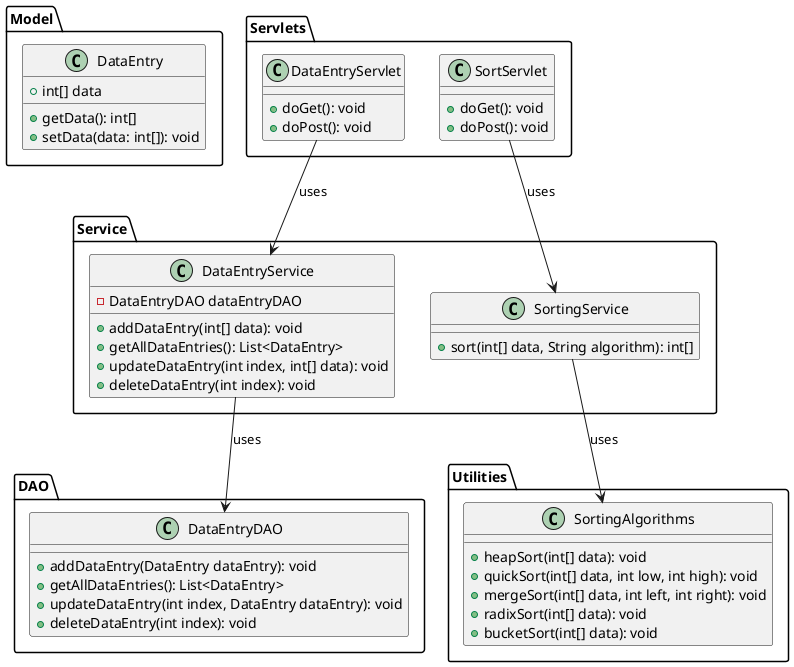

# Advanced Sorting Algorithms Web Application

This project demonstrates a web application that allows users to input arrays of integers and sort them using various advanced sorting algorithms. The application uses Jakarta EE (i.e. Servlets and Jakarta Server Pages (JSP)).

## Table of Contents

- [Overview](#overview)
- [Architecture](#architecture)
- [Setup Instructions](#setup-instructions)
- [Usage Instructions](#usage-instructions)


## Overview

This web application provides a user interface to input arrays of integers and sort them using different algorithms like Heap Sort, Quick Sort, Merge Sort, Radix Sort, and Bucket Sort.

## Architecture

The architecture of the application follows a layered approach, separating concerns into different components.

### Components

- **Model**: Contains the data structures used in the application (`DataEntry`).
- **DAO (Data Access Object)**: Handles data persistence (`DataEntryDAO`).
- **Service**: Contains business logic (`DataEntryService`, `SortingService`).
- **Servlets**: Handles HTTP requests and responses (`DataEntryServlet`, `SortServlet`).
- **Utilities**: Contains sorting algorithm implementations (`SortingAlgorithms`).

## Architecture Diagram


## Setup Instructions

1. **Clone the Repository**:
    ```bash
    git clone https://github.com/elisha1995/AmaliTech-GTP2-Tasks/tree/main/AdvancedSorting
    cd AdvancedSorting
    ```

2. **Build the Project**:
   Ensure you have Maven installed. Run the following command to build the project:
    ```bash
    mvn clean install
    ```

3. **Deploy on Tomcat**:
   Copy the generated WAR file from the `target` directory to the `webapps` directory of your Tomcat installation.

4. **Start Tomcat**:
   Start your Tomcat server and navigate to `http://localhost:8080/AdvancedSorting` in your browser.

## Usage Instructions

1. **Add Data**:
   Navigate to the data entry page and input integers separated by commas. Click "Add Data".

2. **Sort Data**:
   From the list of data entries, choose a sorting algorithm from the dropdown and click "Sort".

3. **View Results**:
   The sorted array and the algorithm used will be displayed on the results page.

## Project Structure:
```css
advancedsorting/
├── docs/
│   ├── architecture-diagram.png
│   ├── components.md
├── src/
│   ├── main/
│   │   ├── java/
│   │   │   ├── com/advancedsorting/
│   │   │   │   ├── model/
│   │   │   │   │   └── DataEntry.java
│   │   │   │   ├── dao/
│   │   │   │   │   └── DataEntryDAO.java
│   │   │   │   ├── service/
│   │   │   │   │   ├── DataEntryService.java
│   │   │   │   │   └── SortingService.java
│   │   │   │   ├── servlet/
│   │   │   │   │   ├── DataEntryServlet.java
│   │   │   │   │   └── SortServlet.java
│   │   │   │   ├── util/
│   │   │   │   │   └── SortingAlgorithms.java
│   │   ├── webapp/
│   │   │   ├── WEB-INF/
│   │   │   │   └── web.xml
│   │   │   ├── data-entry.jsp
│   │   │   ├── sort-result.jsp
│   │   │   ├── styles.css
│   │   │   └── sort-page-styles.css
├── README.md
├── pom.xml
```

